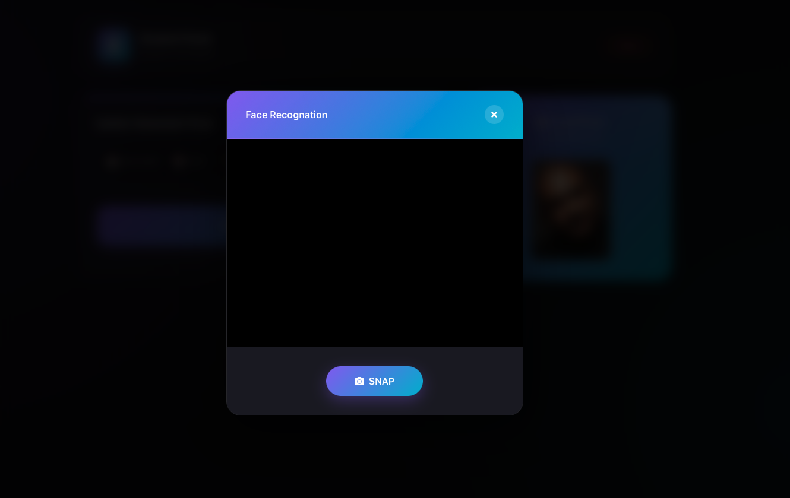
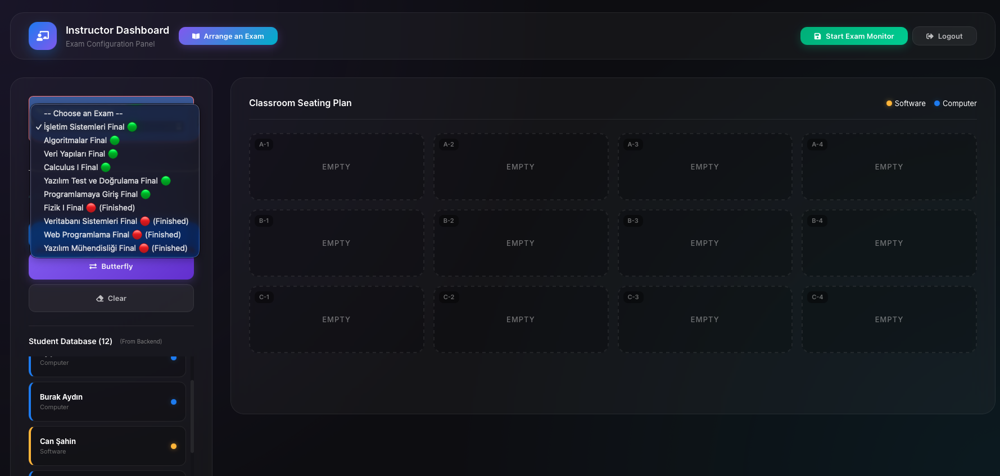
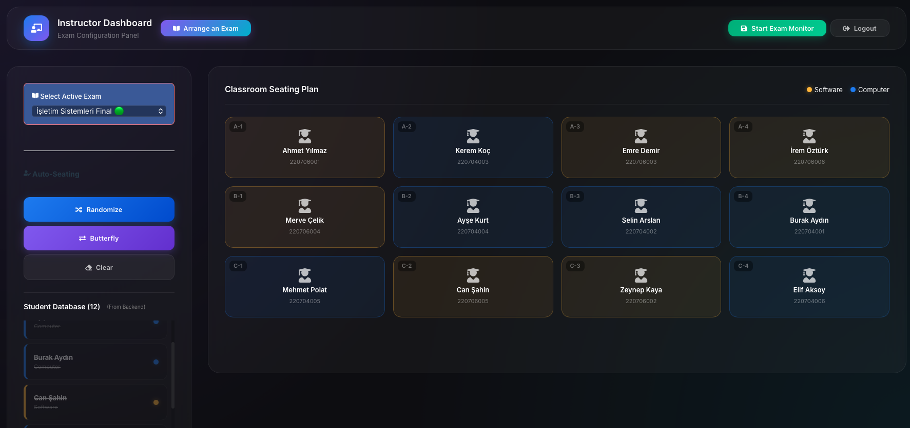
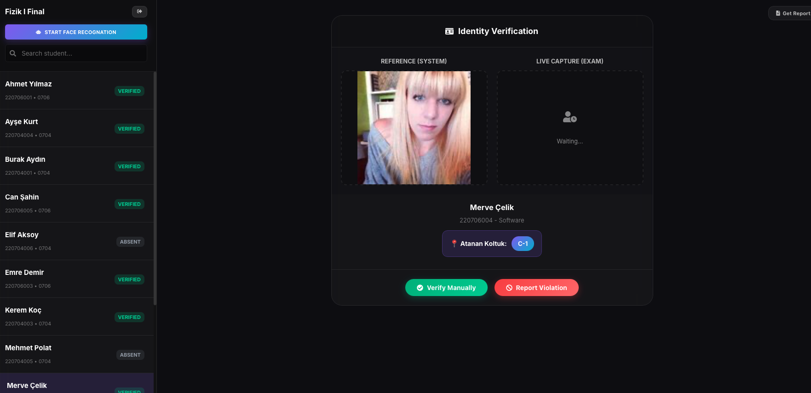
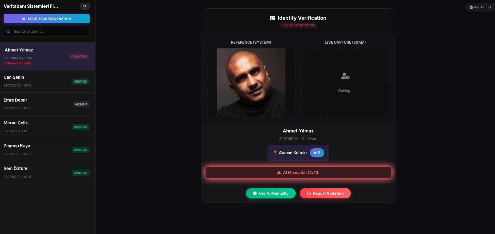
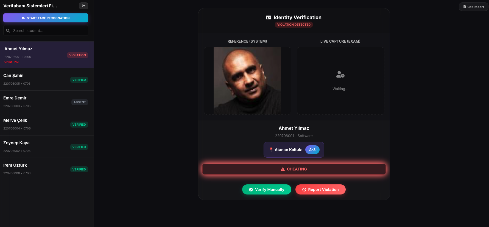
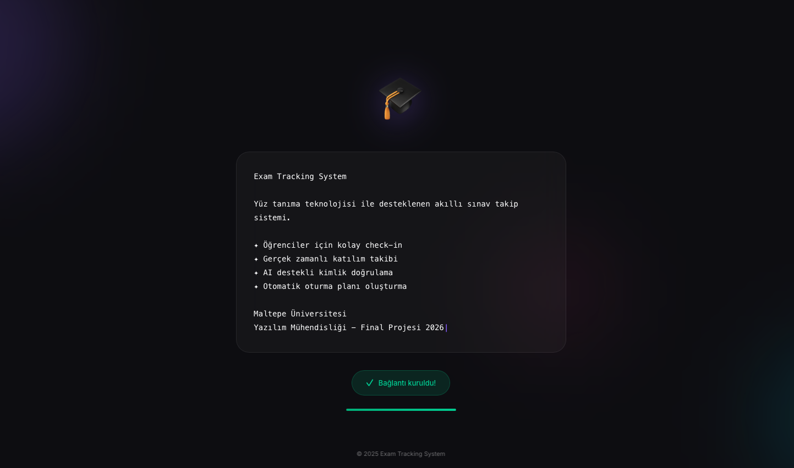

# 🛡️ Exam Security System

> **AI-Powered Identity Verification & Seating Management for Physical Examinations**  
> *Final Project — Software Testing & Validation Course (SENG 405)*

---

## 👥 Team Members
|Erdem BELER	|220706011	|Fullstack / Integration / Database|
|Taylan Alp ÇAKI	|220706010	|Frontend / ML / Testing|

## 🔗 Project Links

| Resource | Link |
|----------|------|
| 🌐 Live Demo | [https://examsec.vercel.app](https://examsec.vercel.app) |
| 📋 Jira Board | [Exam Security System Board](https://taylanalp12.atlassian.net/jira/software/projects/ESS/boards/4) |
| 🗄️ Repository | [Github](https://github.com/erdembeler/examsec) |

---

## 📖 Overview

The **Exam Security System** is a comprehensive web application designed to digitize and secure physical university examinations. It tackles critical challenges including:

- **Student Impersonation ("Joker" Students):** AI-powered face verification ensures the person taking the exam matches the registered student
- **Inefficient Seating Arrangements:** Automated seating algorithms prevent cheating by strategically placing students
- **Manual Attendance Tracking:** Real-time digital check-in with photo evidence

### System Architecture

┌─────────────────────────────────────────────────────────────────────────────┐
│                           EXAM SECURITY SYSTEM                              │
└─────────────────────────────────────────────────────────────────────────────┘

┌─────────────────┐         ┌─────────────────┐         ┌─────────────────┐
│                 │         │                 │         │                 │
│    FRONTEND     │────────▶│    BACKEND      │────────▶│    DATABASE     │
│    (React.js)   │   API   │    (Flask)      │   SQL   │  (PostgreSQL)   │
│                 │◀────────│                 │◀────────│                 │
│    Vercel       │         │    Render       │         │    Neon         │
│                 │         │                 │         │                 │
└─────────────────┘         └────────┬────────┘         └─────────────────┘
                                     │
                                     │ ML
                                     ▼
                            ┌─────────────────┐
                            │                 │
                            │   ML SERVICE    │
                            │   (DeepFace)    │
                            │                 │
                            └─────────────────┘

─────────────────────────────────────────────────────────────────────────────

ENDPOINTS:

  Frontend (Vercel)    :  https://examsec.vercel.app
  Backend  (Render)    :  https://your-backend.onrender.com/api
  Database (Neon)      :  PostgreSQL Cloud

─────────────────────────────────────────────────────────────────────────────

USER ROLES:

  ┌──────────────┐    ┌──────────────┐    ┌──────────────┐
  │   STUDENT    │    │  INSTRUCTOR  │    │   PROCTOR    │
  │              │    │   (admin)    │    │              │
  │  - Check-in  │    │  - Seating   │    │  - AI Check  │
  │  - Photo     │    │  - Start/End │    │  - Violations│
  │  - Status    │    │  - Reports   │    │  - Approve   │
  └──────────────┘    └──────────────┘    └──────────────┘

<!-- SCREENSHOT: System Architecture Diagram -->

---

## ✨ Key Features

### 🎓 Student Module

| Feature | Description |
|---------|-------------|
| Exam Dashboard | View enrolled exams with date, time, and room information |
| Live Camera Check-in | Capture photo via webcam for identity verification |
| Assigned Seat Display | See assigned seat code after successful check-in |
| Status Tracking | Real-time status updates (Absent → Pending → Present) |

<!-- SCREENSHOT: Student Dashboard -->

<!-- SCREENSHOT: Student Check-in Camera -->

---

### 👨‍🏫 Instructor Module

| Feature | Description |
|---------|-------------|
| Exam Selection | Choose from available exams |
| Visual Seating Grid | Interactive 3x4 classroom layout with select-and-drop |
| Random Assignment | One-click random seat assignment |
| Butterfly Algorithm | Alternating department pattern to prevent cheating |
| Save & Load Plans | Persist seating arrangements to database |
| Start/End Exam | Control exam lifecycle and check-in availability |

<!-- SCREENSHOT: Instructor Dashboard Overview -->

<!-- SCREENSHOT: Seating Plan Grid -->

<!-- SCREENSHOT: Butterfly Algorithm Result -->

### 👮‍♂️ Proctor Module

| Feature | Description |
|---------|-------------|
| Student List | View all students with photos and current status |
| ML Verification | One-click face comparison (reference vs live photo) |
| Side-by-Side View | Compare reference and check-in photos visually |
| Seat Compliance | Visualize-verify student is sitting in assigned seat |
| Violation Logging | Record violations with reason, notes, and evidence |
| Status Override | Manually update student status when needed |

<!-- SCREENSHOT: Proctor Dashboard -->

<!-- SCREENSHOT: AI Verification Result -->

<!-- SCREENSHOT: Violation Modal -->

---

### 🚀 Splash Screen (Maintenance Mode)

When the backend server is sleeping (Render free tier), users see an animated splash screen while waiting for the server to wake up:

| Feature | Description |
|---------|-------------|
| Typewriter Animation | Project description typed character by character |
| Backend Health Check | Automatic polling until server responds |
| Minimum Display Time | 10 seconds minimum to ensure smooth UX |
| Progress Indicator | Visual feedback showing connection status |

<!-- SCREENSHOT: Splash Screen -->

---

### 🚀 Maintenance Mode

When the frontend is in maintenance, users see an animated screen while waiting:

<!-- SCREENSHOT: Splash Screen -->

---

## 🛠️ Tech Stack

### Frontend
| Technology | Purpose |
|------------|---------|
| React.js 18 | UI Framework |
| React Router | Navigation |
| Custom CSS3 | Glassmorphism UI Design |
| Vercel | Hosting & Deployment |

### Backend
| Technology | Purpose |
|------------|---------|
| Flask | REST API Framework |
| Flask-CORS | Cross-Origin Resource Sharing |
| psycopg2 | PostgreSQL Adapter |
| Facerecognation | Face Verification ML |
| Render | Hosting & Deployment |

### Database
| Technology | Purpose |
|------------|---------|
| PostgreSQL | Relational Database |
| Neon | Serverless PostgreSQL Hosting |

### Testing
| Technology | Purpose |
|------------|---------|
| pytest | Python Unit Testing |
| unittest.mock | Mocking for ML Services |

---

## 📊 Database Schema

<!-- SCREENSHOT: ERD Diagram -->

---
## 🧪 Testing & Validation

STEP 1: CLONE THE REPOSITORY
─────────────────────────────────────────────────────────────────────────────

$ git clone https://github.com/erdembeler/examsec
$ cd exam-security-system

STEP 2: INSTALL PYTEST
─────────────────────────────────────────────────────────────────────────────

$ pip install pytest

STEP 3: NAVIGATE TO TESTS FOLDER
─────────────────────────────────────────────────────────────────────────────

$ cd tests

STEP 4: RUN ALL TESTS
─────────────────────────────────────────────────────────────────────────────

$ pytest . -v

STEP 5: EXPECTED OUTPUT
─────────────────────────────────────────────────────────────────────────────

test_auth.py::TestStudentIdValidation::test_valid_student_id         PASSED
test_auth.py::TestStudentIdValidation::test_empty_student_id         PASSED
test_auth.py::TestStudentIdValidation::test_wrong_length             PASSED
test_auth.py::TestStudentIdValidation::test_non_digit_characters     PASSED
test_auth.py::TestRoleValidation::test_valid_roles                   PASSED
test_auth.py::TestRoleValidation::test_invalid_roles                 PASSED
test_auth.py::TestLoginValidation::test_valid_input                  PASSED
test_auth.py::TestLoginValidation::test_empty_username               PASSED
test_auth.py::TestLoginValidation::test_empty_password               PASSED
test_auth.py::TestLoginValidation::test_invalid_role                 PASSED
test_auth.py::TestLoginValidation::test_all_fields_empty             PASSED
test_checkin.py::TestCheckInEligibility::test_can_check_in           PASSED
test_checkin.py::TestCheckInEligibility::test_exam_ended             PASSED
test_checkin.py::TestCheckInEligibility::test_duplicate_checkin      PASSED
test_checkin.py::TestStudentStatus::test_present_status              PASSED
test_checkin.py::TestStudentStatus::test_absent_status               PASSED
test_checkin.py::TestStudentStatus::test_not_enrolled                PASSED
test_ml_service.py::TestVerificationResultProcessing::test_high      PASSED
test_ml_service.py::TestVerificationResultProcessing::test_low       PASSED
test_ml_service.py::TestVerificationResultProcessing::test_no_match  PASSED
test_ml_service.py::TestVerificationResultProcessing::test_boundary  PASSED
test_ml_service.py::TestFaceCount::test_single_face                  PASSED
test_ml_service.py::TestFaceCount::test_no_face                      PASSED
test_ml_service.py::TestFaceCount::test_multiple_faces               PASSED
test_ml_service.py::TestMLServiceWrapper::test_successful            PASSED
test_ml_service.py::TestMLServiceWrapper::test_missing_photo         PASSED
test_ml_service.py::TestMLServiceWrapper::test_full_flow             PASSED
test_seating.py::TestSeatCodeGeneration::test_3x4_grid               PASSED
test_seating.py::TestSeatCodeGeneration::test_2x2_grid               PASSED
test_seating.py::TestSeatCodeGeneration::test_empty_grid             PASSED
test_seating.py::TestSeatAssignment::test_all_students_assigned      PASSED
test_seating.py::TestSeatAssignment::test_more_students_than_seats   PASSED
test_seating.py::TestSeatAssignment::test_no_duplicate_seats         PASSED
test_seating.py::TestSeatAvailability::test_available_seat           PASSED
test_seating.py::TestSeatAvailability::test_occupied_seat            PASSED

========================= 35 passed in 0.14s =========================

OPTIONAL: RUN SINGLE TEST FILE
─────────────────────────────────────────────────────────────────────────────

$ pytest test_auth.py -v
$ pytest test_seating.py -v
$ pytest test_ml_service.py -v
$ pytest test_checkin.py -v

TEST FILES OVERVIEW
─────────────────────────────────────────────────────────────────────────────

tests/
├── __init__.py           # Empty file (makes folder a Python package)
├── test_auth.py          # Authentication & validation tests (11 tests)
├── test_seating.py       # Seating logic & assignment tests (8 tests)
├── test_ml_service.py    # ML service & face detection tests (10 tests)
└── test_checkin.py       # Check-in eligibility tests (6 tests)

TEST COVERAGE SUMMARY
─────────────────────────────────────────────────────────────────────────────

  File                │ Description                  │ Tests
  ────────────────────┼──────────────────────────────┼───────
  test_auth.py        │ Login validation, roles      │ 11
  test_seating.py     │ Seat generation, assignment  │  8
  test_ml_service.py  │ AI result processing         │ 10
  test_checkin.py     │ Check-in eligibility         │  6
  ────────────────────┼──────────────────────────────┼───────
  TOTAL               │                              │ 35
─────────────────────────────────────────────────────────────────────────────

